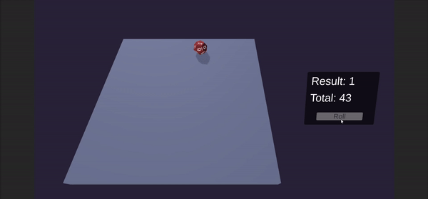

## 12 Sided Dice Roller
### Made with C# and Unity Engine

The project presents the mechanism of throwing a twelve-sided board game dice. Every detail of cube physics has been taken care of here. 
Additionally, the option of rolling the dice using the "Roll" button and the "Bump" effect if the dice get stuck in any position have been implemented.

  

  

  

  

